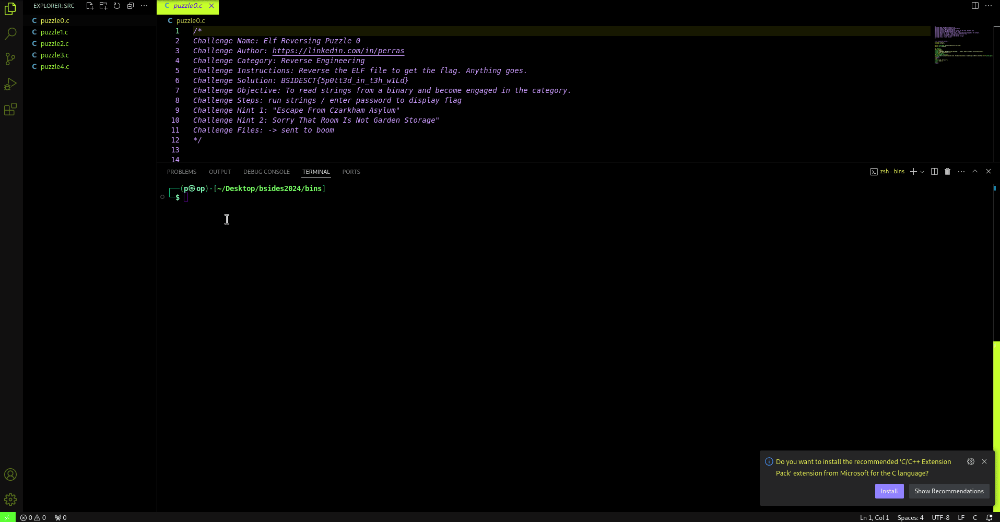
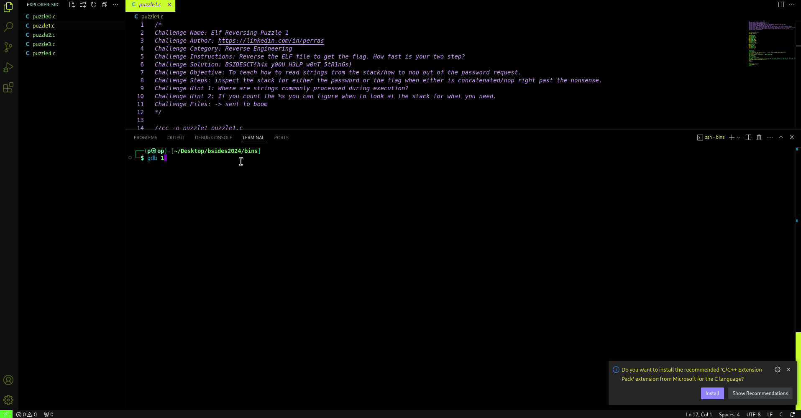
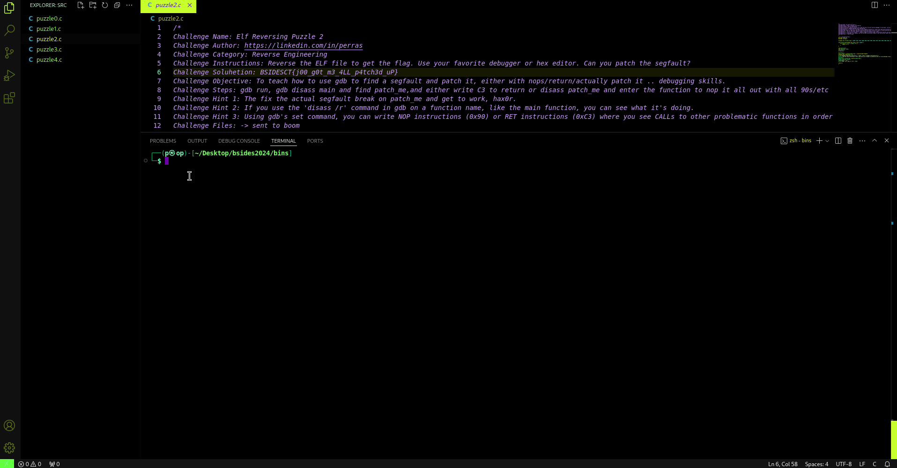
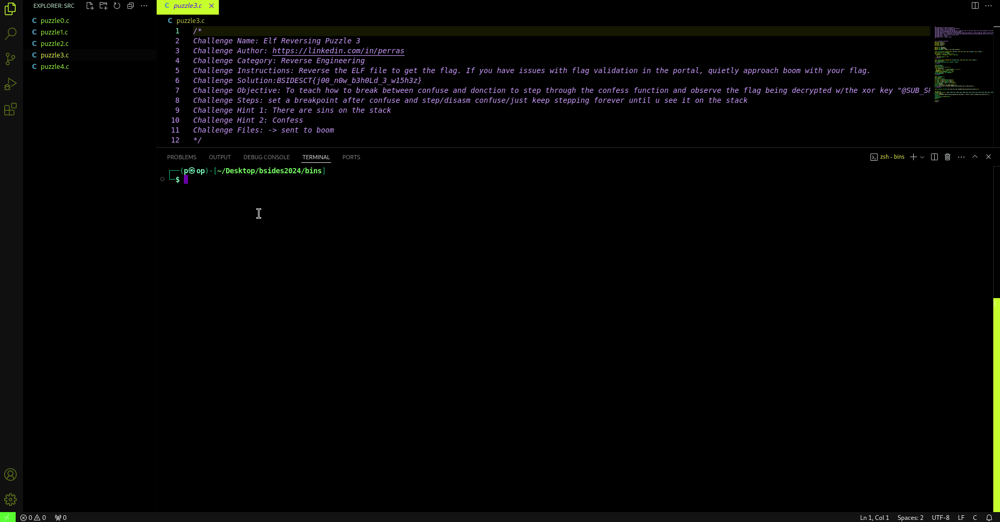

# Reverse

## Elf Reversing Puzzle 0
Reverse the ELF file to get the flag. Anything goes.

**Author:** Perras

### Solution

### Flag
> `BSIDESCT{5p0tt3d_in_t3h_w1Ld}`

## Elf Reversing Puzzle 1
Reverse the ELF file to get the flag. How fast is your two step?

**Author:** Perras

### Solution

### Flag
> `BSIDESCT{h4x_y00U_H3LP_w0nT_5tR1nGs}`

## Elf Reversing Puzzle 2
Reverse the ELF file to get the flag. Use your favorite debugger or hex editor. Can you patch the segfault?

**Author:** Perras

### Solution

### Flag
> `BSIDESCT{j00_g0t_m3_4LL_p4tch3d_uP}`

## Elf Reversing Puzzle 3
Reverse the ELF file to get the flag. If you have issues with flag validation in the portal, quietly approach **boom** with your flag.

**Author:** Perras

### Solution

### Flag
> `BSIDESCT{j00_n0w_b3h0Ld_3_w15h3z}`

## Elf Reversing Puzzle 4
Reverse the ELF file to get the flag. Pay very close attention. If your flag is not working, quietly show **boom** your flag.

**Author:** Perras

### Solution
For this challenge, it is encouraged you come up with some creative solutions to solve! Publish your write up for it and be proud you were able to solve!

Shoutout to 0xbeefbabe for being the only solver of this one :) 

### Flag

Click to reveal

BSIDESCT{R3v3R53_3Ng1nEEr1N6_M4573R}

